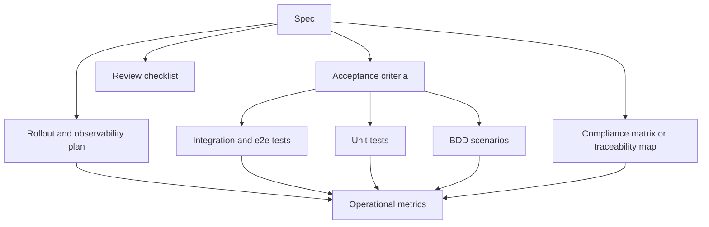
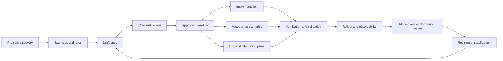

# Spec-Driven Development Specifications in Practice

## Executive summary

Across standards bodies, safety-oriented engineering guidance, open-source RFC processes, and executable-specification tools, the strongest public SDD artifacts converge on the same pattern: they separate **problem framing** from **solution details**, force authors to state **goals and non-goals**, define behavior in a **testable and measurable form**, and create an explicit path from the spec to implementation, verification, rollout, and ongoing conformance checks. ISO/IEC/IEEE 29148 defines requirements-engineering processes and required information items; NASA adds concrete editorial and validation checklists; Volere emphasizes atomic, measurable, testable, traceable requirements; SEI adds six-part quality-attribute scenarios; Cucumber turns acceptance criteria into executable examples; and mature open-source processes such as Python PEPs, Rust RFCs, Swift Evolution proposals, Kubernetes KEPs, and OpenTelemetry specifications all institutionalize many of those same ideas in public templates and review workflows. citeturn12search0turn12search3turn18view0turn6search7turn6search15turn11search5turn32view0turn32view3turn23view1turn25view0turn28view1turn20view0turn31view3

The sharpest divide between good and poor specifications is not domain or technology stack. It is whether the artifact makes omissions visible. Good public specs tend to make authors answer: **What problem are we solving? For whom? What is explicitly out of scope? What exact behavior is required? How will we know it works? How will we migrate, roll back, observe, and measure it?** Kubernetes KEPs require test plans, graduation criteria, upgrade/rollback strategy, production-readiness review, and user-facing documentation; Rust’s 2021 Edition RFC explicitly sets migration plans and metrics; Swift proposals require source- and ABI-compatibility analysis; OpenTelemetry pairs normative requirements with lifecycle/stability rules and a public compliance matrix. Poor artifacts, by contrast, are usually issue tickets that express desire without decision-grade content: they describe a pain point, maybe a sketch of a solution, but omit acceptance criteria, edge cases, compatibility constraints, observability, evaluation strategy, and traceability to code or tests. citeturn20view0turn20view1turn20view2turn25view1turn26view0turn28view1turn28view2turn31view0turn31view3turn17view1turn17view3turn17view4

A practical evaluation model for SDD is therefore layered rather than singular. Start with a **quality gate for the text itself** using checklist criteria such as clarity, completeness, consistency, traceability, verifiability, and rationale. Then convert business rules into **examples and acceptance tests** using example mapping and BDD scenarios. Then map those to **unit, integration, and end-to-end coverage**, including explicit handling of rollout and rollback paths where applicable. Finally, judge the spec not only by implementation completion but by **quality metrics** such as traceability completeness, conformance coverage, migration success, defect escape, adoption, and observable runtime signals. NASA, Kubernetes, Rust, OpenTelemetry, and Cucumber each contribute a different part of this evaluation stack, while research literature strengthens the case that ambiguity, verifiability, and incomplete traceability are among the most consequential defects in natural-language requirements. citeturn18view0turn18view2turn20view0turn26view0turn31view0turn31view3turn32view2turn32view3turn5search3turn5search4turn5search24

A concise way to remember the findings is this:

| What strong specs do | Why it matters |
|---|---|
| State the problem, goals, and non-goals up front. citeturn20view0turn25view0turn28view0 | Prevents solution drift and scope creep. |
| Use precise requirement language and measurable response conditions. citeturn18view0turn11search5turn31view1 | Makes review and verification possible. |
| Tie the spec to tests, rollout, and operational signals. citeturn20view0turn18view2turn31view0turn31view3 | Turns the document into an executable governance artifact rather than a memo. |
| Preserve traceability to code, docs, and versioned decisions. citeturn20view2turn23view0turn25view2 | Makes change impact and compliance auditable. |

## Canonical guides and templates

The most canonical public sources do not all use the same terminology, but they overlap heavily in what they demand from a “good” specification. A useful synthesis is below.

| Guide or template | What it standardizes | Why it matters for SDD |
|---|---|---|
| ISO/IEC/IEEE 29148 official summary citeturn12search0turn12search3 | Requirements-engineering processes, required information items, and life-cycle integration. | Establishes the broadest formal baseline for what a requirements artifact must contain. |
| NASA Appendix C and NPR 7150.2D citeturn18view0turn18view2 | “Shall” usage, editorial rules, validation checklist, test plans/procedures/reports, testing against requirements, code coverage interpretation. | Especially strong on requirement phrasing, verification readiness, and traceability. |
| Volere template, atomic requirements, and “ten tests” citeturn6search3turn3search16turn6search7turn6search15 | A comprehensive specification shell, requirement attributes, and quality audits for relevance, coherency, traceability, and completeness. | Strong practical bridge between classic RE and day-to-day product work. |
| SEI quality-attribute scenarios citeturn11search5turn11search13 | Six-part quality scenarios: stimulus, source, environment, artifact, response, response measure. | Best public pattern for making nonfunctional requirements concrete and testable. |
| Cucumber user stories, Gherkin, and example mapping citeturn32view0turn32view1turn32view2turn32view3 | Story format, executable acceptance criteria, business rules, and example discovery. | Best public pattern for converting requirements into living acceptance tests. |
| Python PEP process citeturn23view1 | Design document + rationale + public discussion + reference implementation expectations. | Strong for language/platform evolution where consensus and historical record matter. |
| Rust RFC template and process citeturn25view0turn25view2 | User-level explanation, reference-level explanation, drawbacks, alternatives, prior art, unresolved questions, future possibilities, public FCP. | Excellent at forcing tradeoff analysis and reader-oriented explanation. |
| Swift Evolution process and proposal template citeturn28view0turn28view1 | Review flow, prototype implementation expectation, source compatibility, ABI compatibility, adoption implications, future directions. | Excellent where compatibility and ecosystem breakage are first-order concerns. |
| Kubernetes KEP template citeturn20view0 | Summary, goals/non-goals, proposal, design details, test plan, graduation criteria, upgrade/downgrade, version skew, production readiness review. | One of the strongest public templates for end-to-end feature governance. |
| OpenTelemetry spec versioning and compliance matrix citeturn31view0turn31view3 | Normative requirements, stability states, repository-level versioning rules, and per-language conformance reporting. | A mature model for keeping a spec “live” after publication. |

Two themes cut across these sources. First, strong templates make the reader switch modes at the right time: problem and explanation first, implementation precision second. Rust explicitly separates **guide-level** and **reference-level** explanation; Swift separates design from source/ABI/adoption analysis; KEPs separate proposal detail from test and production-readiness detail. citeturn25view0turn28view1turn20view0

Second, strong templates convert quality from an impression into a checklist. NASA’s validation checklist asks whether requirements are clear, concise, atomic, complete, level-appropriate, free of implementation specifics, consistent, traceable, uniquely referenceable, and verifiable; Volere similarly treats auditability, atomicity, measurability, testability, and traceability as explicit requirement attributes rather than stylistic preferences. citeturn18view0turn3search16turn6search15

## Comparative analysis of public examples

The table below summarizes twelve public artifacts spanning open-source language features, infrastructure specifications, framework RFCs, startup/community discussions, and issue-ticket “specs.” The “good/bad” label is an assessment of the artifact **as a development specification**, not a judgment of whether the feature idea itself is good.

| Example | Type | Assessment | Key strength or failure mode | Evaluation approach |
|---|---|---|---|---|
| Kubernetes KEP-753 Sidecar Containers + enhancement issue citeturn20view1turn20view2 | Open-source feature spec | Good | Clear summary, motivation, detailed design, rollout, and milestone-linked traceability to code/docs PRs. | Test plan, graduation criteria, PRR, milestone issue, linked code/docs PRs. citeturn20view0turn20view2 |
| Python PEP 634 + CPython tracking issue citeturn23view2turn23view0 | Language specification | Good | Precise syntax/semantics plus linked implementation and docs PRs. | Public discussion, reference implementation, linked PRs/docs, release documentation. citeturn23view1turn23view0 |
| Rust RFC 3085 Edition 2021 citeturn25view1turn26view0 | Language/process RFC | Good | Strong guide/reference split; unusually explicit migration plan and success metrics. | Migration lints, crater-based metrics, adoption metrics, tracking artifacts. citeturn26view0turn25view2 |
| Swift SE-0296 Async/Await citeturn28view2 | Language proposal | Good | Handles semantics, source compatibility, ABI stability, and future directions in one artifact. | Prototype-before-review, formal review prompts, compatibility analysis. citeturn28view0turn28view1 |
| React RFC 0188 Server Components citeturn8view1turn30search1 | Framework RFC | Good, with weaker direct testability | Excellent motivation, examples, constraints, drawbacks, alternatives, and adoption framing. Less explicit on concrete acceptance metrics. | RFC review, FCP, later lint/build/runtime enforcement for violations. citeturn8view1turn30search1 |
| OpenTelemetry event and database semantic conventions + compliance matrix citeturn31view1turn31view2turn31view0 | Cross-language normative specification | Good | Uses normative MUST/SHOULD language, status labels, and public implementation conformance reporting. | Stability lifecycle rules, per-language compliance matrix, versioning requirements. citeturn31view3turn31view0 |
| Cucumber user story + Gherkin feature examples citeturn32view0turn32view3 | Executable acceptance spec | Good | Acceptance criteria become scenarios and step definitions; highly testable. | Example mapping, executable scenarios, observable outcomes. citeturn32view2turn32view3 |
| Supabase SQL Editor 2.0 RFC discussion citeturn33search0turn33search1 | Startup/community discovery RFC | Mixed | Strong discovery and motivation; weaker on final scope, testability, and exit criteria because it is still exploratory. | Community feedback and iterative narrowing. citeturn33search0 |
| PhotoPrism issue #683 reverse-order sorting citeturn17view0 | Compact issue-level spec | Surprisingly good | Includes a user story and short MUST-style acceptance criteria, but limited rollout and edge-case analysis. | Issue review and later implementation work; no explicit test map yet. citeturn17view0 |
| Bun issue #26552 package.json5 support citeturn17view1 | Startup/open-source feature request | Poor | States a desire and a rough behavior, but no constraints, compatibility analysis, examples matrix, or success criteria. | Minimal issue triage only. citeturn17view1 |
| Zettlr issue #810 automatic backlinking citeturn17view3 | Open-source enhancement request | Poor | Good user motivation, but solution is under-specified and untestable around conflicts, reversibility, and file semantics. | Minimal issue triage only. citeturn17view3 |
| Backstage issue #12394 guest token generation for development citeturn17view4 | Open-source suggestion | Poor to mixed | Good problem context, but no threat model, acceptance tests, migration path, or explicit non-goals. | Offline discussion and issue review; no explicit verification plan. citeturn17view4 |

Several examples are especially instructive when you read them as SDD artifacts rather than as feature ideas.

The Kubernetes KEP template is one of the clearest public demonstrations of how to “force completeness” in a spec. Even before you read KEP-753 itself, the template requires summary, goals, non-goals, detailed design, prerequisite/unit/integration/e2e tests, graduation criteria, upgrade and rollback strategy, version-skew strategy, and a production-readiness review with questions about enablement, rollback, monitoring, SLOs/SLIs, scalability, and troubleshooting. The sidecar-containers tracking issue then extends traceability by linking the KEP to milestone targets, code PRs, and website documentation PRs for alpha, beta, and stable release stages. That is unusually strong public evidence of spec → implementation → docs traceability. citeturn20view0turn20view2

Python’s PEP system is similarly strong, but in a different way. PEP 1 says a PEP should provide a concise technical specification and rationale, and recommends co-developing at least a prototype implementation. PEP 634 then does exactly what a language spec should do: it carries formal metadata, release targeting, and detailed grammar and semantic constraints. The CPython tracking issue closes the loop by listing implementation and documentation pull requests associated with the proposal. In practice, that means the “spec” is not just prose; it is a versioned artifact embedded in a public workflow and tied to reference implementation work. citeturn23view1turn23view2turn23view0

Rust’s 2021 Edition RFC is exemplary because it is unusually explicit about how a spec will be judged after it ships. The RFC first explains the design in user terms—interoperability across editions, easy migration, gradual adoption, the goal that Rust still feel like one language—and then drops into reference-level detail about migration lints, tooling workflow, breakage patterns, and migration plans. Most importantly, it names success metrics: a large majority of crates should migrate without manual intervention, most migrated crates should take less than an hour, and adoption can be tracked through survey usage. Few public specs are this transparent about what “success” numerically means. citeturn26view0turn25view1turn25view0

Swift’s async/await proposal shows another hallmark of a robust design spec: it makes compatibility analysis a first-class section, not an afterthought. The proposal explicitly discusses contextual keywords, concrete compatibility edge cases, ABI stability, and API resilience. The Swift process and template generalize that expectation by requiring proposals to address source compatibility, ABI compatibility, and adoption implications. This is a strong pattern for any platform or SDK team where backward compatibility is part of the product contract. citeturn28view2turn28view1turn28view0

OpenTelemetry is the strongest example in this set of a spec that remains “alive” after publication. The event and database semantic-convention pages use normative terms such as MUST, SHOULD, SHOULD NOT, and MAY, and they attach lifecycle/status labels like Development, Stable, or Mixed. The project then publishes a language-by-language compliance matrix that shows which required and optional features are actually implemented. That is exactly the sort of post-spec evaluation structure many SDD efforts lack. citeturn31view1turn31view2turn31view3turn31view0

Cucumber’s public guidance is the cleanest example of acceptance criteria becoming executable specification. It recommends user stories that say who, what, and why, and then acceptance criteria expressed as Gherkin scenarios. The reference explicitly says examples are both documentation and tests, recommends domain-language phrasing over UI-specific procedures, and emphasizes observable outcomes for Then-steps. This is a practical answer to the perennial “How do I know this requirement is testable?” question: if it cannot be turned into examples and observable outcomes, it is usually not yet ready. citeturn32view0turn32view1turn32view3

The smaller issue-ticket examples make the opposite point. PhotoPrism’s sorting request is compact but relatively strong because it includes a usable user story and short MUST-style acceptance criteria. By contrast, Bun’s `package.json5` request mostly says “this would be awesome” and specifies one behavior if `package.json` is missing, but does not answer obvious questions about precedence, interoperability with tooling, lockfile behavior, error handling, or migration. Zettlr’s backlinking request gives motivation and a syntax sketch, but leaves unanswered whether backlinks are synchronous or batch-updated, what happens on rename/delete, whether users can opt out per note, and how correctness would be verified. Backstage’s development-token suggestion has valuable problem context, but because it touches authentication it especially needs non-goals, threat boundaries, environment scoping, explicit test cases, and rollback conditions—which the issue does not yet provide. citeturn17view0turn17view1turn17view3turn17view4

The startup-oriented examples are revealing in another way. Supabase’s SQL Editor 2.0 discussion is good discovery writing: it states the goal, cites pain points from issues/support/user interviews, and deliberately asks for more use cases before committing to a solution. That is healthy at the discovery phase. But as an implementation spec, it is incomplete until it adds specific scope boundaries, user journeys, edge cases, acceptance criteria, and a verification plan. Good SDD usually needs both artifacts: a discovery RFC and a later implementation spec. citeturn33search0turn33search1

## How good specs are evaluated

A specification should be evaluated in at least five distinct ways. Treating “peer review” as the only evaluation step is one of the main anti-patterns in public practice.

| Evaluation method | What is being judged | Strong public example |
|---|---|---|
| Editorial and semantic checklist review | Clarity, atomicity, completeness, terminology, level, freedom from implementation detail, traceability, verifiability. | NASA Appendix C validation checklist; Volere “ten tests.” citeturn18view0turn6search7 |
| Example and acceptance review | Whether the requirement can be turned into concrete business rules and examples before coding starts. | Cucumber example mapping and Gherkin scenarios. citeturn32view2turn32view3 |
| Unit/integration/e2e mapping | Whether the spec names the test layers needed to verify it. | Kubernetes KEP test plan sections; NASA’s required test plans, procedures, tests, and reports. citeturn20view0turn18view2 |
| Rollout and operational readiness review | Whether the feature can be enabled, disabled, monitored, rolled back, and supported in production. | Kubernetes PRR questions and OpenTelemetry stability/versioning rules. citeturn20view0turn31view3 |
| Metrics and conformance review | Whether the organization can quantify conformance, migration success, adoption, or coverage. | Rust edition metrics, OpenTelemetry compliance matrix, NASA code-coverage reasoning. citeturn26view0turn31view0turn18view2 |

A useful mental model is this:

This layered model is not hypothetical. Kubernetes explicitly asks for prerequisite testing updates plus unit, integration, and e2e tests in the spec template; Cucumber treats examples as executable specifications; OpenTelemetry publishes conformance matrices; NASA requires projects to establish test plans, procedures, test reports, and to test software against its requirements. citeturn20view0turn32view3turn31view0turn18view2

The most important public review checklists are more rigorous than most product teams realize. NASA’s checklist asks whether each requirement expresses only one thought, is complete, is at the correct level, is free of implementation specifics and operational descriptions, is consistent with the glossary and related systems, is uniquely referenceable, and can be tested, demonstrated, inspected, or analyzed. Swift’s review prompts ask reviewers to judge whether the problem is significant, whether the proposal fits the direction of the language, how it compares with other ecosystems, and how much effort the reviewer invested. Volere’s quality-audit material asks whether the specification is fit for purpose and whether atomic requirements are relevant, coherent, traceable, and complete. citeturn18view0turn28view0turn3search16turn6search7

For metrics, three public patterns stand out. Rust uses **migration and adoption metrics**; OpenTelemetry uses a **feature compliance matrix**; NASA uses **coverage and traceability interpretation**. NASA’s coverage guidance is particularly useful because it treats uncovered code as a signal that something is wrong in one of four ways: a requirement is missing, a test is missing, code is extraneous/dead, or code is deactivated for another configuration. That is a sophisticated example of how test results can feed back into the specification itself rather than merely pass or fail a build. citeturn26view0turn31view0turn18view2

Academic work adds empirical support to those public practices. One study reported evidence that more complete traceability is associated with lower expected defect rates, while recent work on requirements smells found practitioners rate ambiguity and verifiability among the most severe smell types. Other recent research proposes automatic testability measurement for natural-language requirements based on smell detection rather than requiring a fixed authoring template. These findings support a practical conclusion: teams can and should measure requirement quality before implementation, not only after bugs escape. citeturn5search3turn5search4turn5search24turn5search12

## Rewriting poor specs

The rewrites below are **assistant-authored improvements** based on weaknesses visible in the original public artifacts. The point is not to “correct” the original authors; it is to show how a vague issue can be transformed into a decision-grade SDD spec.

**Rewrite for Bun issue #26552 package.json5 support**  
The original issue states a user need and a rough behavior—look for `package.json5` when `package.json` is absent—but it does not define precedence, compatibility, migration, or what success means. citeturn17view1

**Improved spec draft**

**Goal**  
Allow Bun projects to use a JSON5 package manifest where comments and trailing commas are desirable, without breaking interoperability with existing package-management workflows.

**Non-goals**  
This change does not redefine npm’s manifest standard, does not require other tools to consume JSON5 manifests, and does not change lockfile semantics.

**Requirements**  
Bun shall support a `package.json5` manifest only when `package.json` is absent. If both files are present, Bun shall fail with a clear diagnostic instructing the user to keep exactly one manifest. Bun shall parse `package.json5` according to JSON5 syntax and normalize it internally to the same manifest schema used for `package.json`. Bun shall preserve existing behavior for dependency resolution, scripts, workspaces, and lockfile generation.

**Acceptance criteria**  
A project containing only `package.json5` installs successfully. A project containing both `package.json` and `package.json5` fails with a deterministic error. Manifest fields supported in `package.json` behave identically when supplied through `package.json5`. Lockfile output is identical for semantically equivalent manifests.

**Test mapping**  
Unit tests cover parsing and precedence rules. Integration tests cover install, workspace resolution, scripts, and lockfile generation. Compatibility tests verify equivalent behavior for paired `package.json` and `package.json5` fixtures.

**Traceability and rollout**  
REQ-1: single-manifest precedence; REQ-2: JSON5 parsing; REQ-3: semantic equivalence; REQ-4: deterministic diagnostics. Rollout metric: percentage of install failures attributable to manifest ambiguity should remain negligible after release.

**Rewrite for Zettlr issue #810 automatic backlinking**  
The original issue proposes a syntax variant and user motivation, but it leaves file-system behavior, conflicts, disabling behavior, and verification undefined. citeturn17view3

**Improved spec draft**

**Goal**  
Provide optional automatic backlink management so that when Note A links to Note B, Note B can display a backlink to Note A without requiring manual edits.

**Non-goals**  
This feature does not attempt full graph analytics, ranking, or semantic inference. It does not rewrite historical notes unless the user opts in.

**Requirements**  
Users shall be able to enable or disable automatic backlinks globally and per note. When enabled, creating a forward link from Note A to Note B shall create a backlink entry in Note B. Renaming, moving, or deleting either note shall update or remove backlinks deterministically. Backlinks shall be idempotent: repeating the same link operation shall not create duplicates. Users shall be able to choose whether backlinks are stored in file content or rendered virtually by the application.

**Acceptance criteria**  
Creating a new link yields exactly one backlink. Removing the forward link removes the backlink. Renaming either note preserves backlink correctness. Opening a note with 1,000 backlinks remains within agreed performance thresholds. Users can disable the feature and existing manually written links remain untouched.

**Test mapping**  
Unit tests cover link graph updates and idempotency. Integration tests cover rename, delete, move, sync, and file-content versus virtual-render modes. UX tests cover discoverability and opt-out behavior.

**Traceability and rollout**  
REQ-1 opt-in control; REQ-2 backlink creation/removal; REQ-3 rename/delete correctness; REQ-4 performance bound; REQ-5 content-versus-virtual mode. Operational metric: backlink reconciliation errors per 10,000 note operations.

**Rewrite for Backstage issue #12394 guest tokens for development**  
The original issue has useful setup context and a plausible implementation idea, but because it touches auth it needs environment boundaries, security assumptions, and explicit non-goals. citeturn17view4

**Improved spec draft**

**Goal**  
Reduce local-development friction by allowing guest-mode Backstage instances to generate development-only tokens for internal API calls.

**Non-goals**  
This feature shall not be enabled in production by default. It shall not create tokens accepted by production identity providers. It shall not weaken existing authentication flows for non-development deployments.

**Requirements**  
A local configuration flag shall enable development guest tokens only in explicitly marked development environments. Tokens generated under this mode shall be visibly marked as development-only and rejected when the application runs in production mode. The token manager and `fetchApi` shall expose consistent behavior for local guest sessions. Audit logs or debug logs shall make development-token usage observable.

**Acceptance criteria**  
In local-development mode, a guest session can call APIs that currently require a Backstage token. In production mode, the same configuration is rejected or ignored safely. Development tokens cannot be replayed against production services. Logs make token source and environment explicit.

**Test mapping**  
Unit tests cover configuration gating and token labeling. Integration tests cover local guest flows, production rejection, and replay failure against production-mode services. Security tests verify environment isolation.

**Traceability and rollout**  
REQ-1 environment gating; REQ-2 token generation path; REQ-3 production rejection; REQ-4 observability. Release gate: security review must sign off before merge.

**Rewrite for OpenHands issue #1828 documentation on fixing GitHub issues**  
The original issue includes draft prose, which is already better than a one-line request, but it still lacks audience definition, task success criteria, edge cases, and a validation plan for the documentation itself. citeturn17view2

**Improved spec draft**

**Goal**  
Publish a documentation page that teaches users how to configure OpenHands to clone a repository, modify code for a GitHub issue, push a branch safely, and open a pull request.

**Audience**  
Users with GitHub familiarity but no prior OpenHands-specific workflow knowledge.

**Requirements**  
The documentation shall describe prerequisites, including token scope, fork-versus-direct-push behavior, environment-variable setup, and the difference between write access and fork workflows. It shall include one end-to-end example and one failure-mode example. It shall warn users not to expose tokens in prompts or logs. It shall identify where generated branches and pull-request links appear.

**Acceptance criteria**  
A first-time user can follow the guide to complete the happy path against a test repository. A user without write access can complete the fork workflow. A user missing token configuration sees a documented error and recovery path. Security-sensitive data is not printed in the documented workflow.

**Test mapping**  
Docs validation includes a dry-run happy-path walkthrough, a fork-path walkthrough, and link checking. Support metric: reduction in duplicate “how do I fix GitHub issues?” questions after publication.

**Traceability and rollout**  
REQ-1 prerequisites; REQ-2 happy path; REQ-3 fork path; REQ-4 failure handling; REQ-5 token safety. Publish only when walkthrough validation passes.

## Good and bad practices synthesized

The strongest practices are not complicated; they are disciplined. The table below distills them with rationale grounded in the standards and examples above.

| Good practice | Rationale | Evidence |
|---|---|---|
| Separate problem, goals, and non-goals from solution detail. | Reviewers can decide whether the right problem is being solved before debating implementation. | KEP template, Rust RFC template, Swift process/template. citeturn20view0turn25view0turn28view1 |
| Write requirements as atomic statements or bounded scenarios. | Atomicity reduces ambiguity and improves traceability, testability, and change impact analysis. | NASA checklist, Volere atomic requirements, SEI quality scenarios. citeturn18view0turn6search15turn11search5 |
| Prefer what/observable behavior over how/UI mechanics. | Specs survive refactors; tests become less brittle. | NASA’s “what not how,” Cucumber’s declarative-style guidance. citeturn18view0turn32view1 |
| Make evaluation explicit in the spec. | If the test strategy is absent, the feature is usually under-specified. | Kubernetes test plan, NASA test-plan requirements, Cucumber executable examples. citeturn20view0turn18view2turn32view3 |
| Include compatibility, migration, and rollback analysis. | Real-world change cost is determined by transition risk, not only by local correctness. | Swift proposals, Rust edition RFC, KEP PRR. citeturn28view1turn28view2turn26view0turn20view0 |
| Keep traceability public and versioned. | Future maintainers need to find the spec, the code, the docs, and the decisions that connected them. | CPython PEP tracking issue, Kubernetes enhancement issue, Rust RFC process. citeturn23view0turn20view2turn25view2 |
| Use measurable quality metrics where possible. | “Done” becomes falsifiable instead of interpretive. | Rust adoption/migration metrics, OpenTelemetry compliance matrix, NASA coverage analysis. citeturn26view0turn31view0turn18view2 |

The most common failure modes are equally consistent.

| Bad practice | Why it fails | Seen in examples |
|---|---|---|
| “It would be nice if…” as the main requirement form. | Expresses desire, not decision-grade behavior. | Bun, Zettlr, OpenHands docs issue. citeturn17view1turn17view3turn17view2 |
| No explicit non-goals. | Scope expands silently and reviewers cannot tell what is intentionally omitted. | Bun, Backstage, Supabase discovery RFC. citeturn17view1turn17view4turn33search0 |
| Solution sketch without edge cases or invariants. | Implementation choices get made before behavior is stabilized. | Zettlr, Backstage, some exploratory startup discussions. citeturn17view3turn17view4turn33search0 |
| Acceptance criteria that are qualitative but not observable. | Teams cannot agree whether the feature is complete. | Several issue-level requests omit user-visible proof conditions. citeturn17view1turn17view3turn17view4 |
| No compatibility or migration analysis. | A feature can be locally correct and still be ecosystem-hostile. | Bun and many issue-level feature requests. citeturn17view1turn17view4 |
| No link from spec to code, docs, and ongoing conformance. | The artifact dies after approval; later teams cannot audit drift. | Weak issue-level examples contrast sharply with KEP, PEP, Rust, and OpenTelemetry approaches. citeturn20view2turn23view0turn25view2turn31view0turn17view1turn17view3 |

A practical spec lifecycle that incorporates those lessons looks like this:

This lifecycle is not an imported process diagram; it is a synthesis of the public mechanisms used by NASA, Cucumber, Kubernetes, Swift, Rust, and OpenTelemetry: requirements and examples first, baseline and review second, implementation tied to tests and traceability third, and conformance plus metrics after release. citeturn18view0turn18view2turn32view2turn20view0turn28view0turn25view2turn31view0turn31view3

**Open questions and limitations.** Public examples skew toward language/framework RFCs and GitHub issue artifacts because many high-quality internal product specs are private. For that reason, some “bad” examples in this report are really **de facto specs** used for planning rather than formal requirement documents. That limitation does not weaken the main conclusion: the difference between strong and weak SDD artifacts is primarily whether they make behavior, verification, and traceability explicit.
